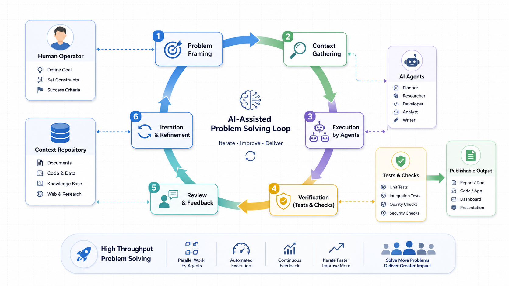

# Vibe 方法论：如何利用 AI 快速高效解决真实问题




先说结论：这不是一条“十分钟用 AI 做网页”的爽片，而是一场真实项目复盘式技术分享。主题是：如何把 AI 组织成一个能调研、设计、执行、反驳、验收的高吞吐问题解决系统。

如果只把它理解成一个工具技巧，很容易低估它。真正值得讨论的是，复杂问题正在被重新拆分、分发、验证和收束。

## 开场：AI 时代第一生产资料

我最近总结出一个很不严肃，但越想越真实的 AI 工作方法论。

第一条，token 要够。

听起来像是一个被大模型账单打穿的人，在深夜对着余额说胡话。

但你真的用 AI 做复杂项目时，会发现这句话不是玩笑。

因为 AI 时代真正限制你的，很多时候不是模型会不会，而是你敢不敢把问题讲完整。

你有没有给它足够上下文？

你有没有让它先探索，再生成，再被另一个模型反驳，再升级？

你有没有能力同时开几个线程推进，但最后还能收回来？

你有没有耐心把一个看起来很小的 idea，一直推到真的有结果？

这篇文章不是教你“怎么用 AI 十分钟做一个炫酷网页”。

这种视频很多，而且十分钟之后通常还有十小时擦屁股。

我想讲一个更底层的东西：

```text
如何利用 AI 快速高效地解决真实问题。
```

包括未知领域调研、方案设计、紧急 bug 处理、思路整理、长程任务推进，以及现在很火的 vibe coding。

我会结合我自己做 Script Killer 的过程来讲。

这个项目的目标是：把一堆原始视频资料，变成拉片证据、结构提炼、创作包，最后生成可以落地执行的内容方案。

说人话就是：

我给它一堆视频，它帮我看完、拆完、总结完，最后产出一套能落地的方案。

听起来很适合 AI，对吧？

但真正做的时候，问题一个接一个：

视频路径写进数据库了，但文件是不是真的上传了？

worker 代码写了，但任务有没有真的消费？

测试全绿，但是不是 fake client 自己和自己玩？

旧文档说没接上，新代码是不是已经修了？

ffprobe、数据库、队列、环境变量、前端页面、脚本质量，每一个都能把你卡住。

所以这篇文章不是成功学。

这篇文章更像事故复盘之后的方法论。

## 先讲结论：Vibe 不是随便爽一下

很多人理解 vibe coding，会把它想成一种很玄的状态：

我随便说点想法，AI 一顿狂写，然后项目就出来了。

这个理解只对了一半。

AI 确实能帮你狂写。

但如果你没有主线、没有边界、没有验收，它狂写出来的东西可能就像一锅大乱炖。

看起来料很多，吃完不知道自己吃了什么。

我现在理解的 vibe coding，不是随便 vibe 一下，让 AI 变魔术。

它更像一个高吞吐工作台。

一个线程负责探索未知领域。

一个线程负责做 first beta。

一个线程负责挑毛病。

一个线程负责修 bug。

一个线程负责整理主线。

一个线程负责未来架构。

但注意，不是上来就开十个线程。

那不叫高吞吐，那叫把混乱复制十份。

正确顺序是：

```text
先收敛主线，再 fork 支线，最后回到主线验收。
```

主线不清楚，并行只会加速混乱。

主线清楚，并行才会提高吞吐。

这就是这篇文章的核心。

## 第一招：未知领域先要地图，不要直接开干

进入未知领域，第一反应不要是：

帮我做。

而是：

先给我地图。

比如我做 Script Killer，一开始想法非常大。

上传视频、自动拉片、提炼结构、生成脚本、导出分镜、最好还能自动剪片。

你把这个需求直接丢给 AI，它很容易给你一份宏大方案：

素材系统要做。

用户系统要做。

任务队列要做。

模型编排要做。

知识库要做。

权限系统要做。

日志系统要做。

最后你看完只会产生一种朴素的情绪：

我是谁？

我在哪？

我为什么要打开这个对话框？

所以未知领域第一步，不是让 AI 直接写代码，而是让它给你地图。

地图里你重点看三件事。

第一，这个领域通常怎么拆模块。

第二，最小 beta 到底做哪一刀。

第三，哪些东西看起来很诱人，但现在不应该碰。

比如视频脚本工具的 first beta，不一定要真的自动剪辑成片。

它可以先做到：

原始资料能进来。

系统能提炼结构。

能生成一版人可以审核、修改、拍摄的教学脚本。

这就已经有价值了。

不要一开始就追求“全自动大片生成”。

那很容易从做产品，变成修仙。

## 第二招：先做 First Beta，再让 B 模型来骂

AI 协作里，我非常建议你养成一个动作：

先让一个模型做 first beta。

再让另一个模型来骂它。

注意，我说的是骂，不是夸。

很多人会把 AI 当情绪价值机器。

你问它：

你觉得我这个想法怎么样？

它说：

这个想法非常有潜力。

你很开心。

项目没有任何进展。

真正有用的问法是：

```text
请你站在反方 reviewer 视角审查这个方案。
不要夸。
请找出它最可能失败的 5 个原因。
每个原因都要给证据、风险等级和修正建议。
请区分：必须现在修、下个版本修、未来再说。
```

这时候 AI 才开始像 reviewer。

我在开发 Script Killer 的时候，很多最有价值的结论，不是来自“写代码”的 AI，而是来自“挑刺”的 AI。

它会问：

你的测试是不是只测了 fake client？

你的视频上传是不是真的写进 Storage？

你的 worker 有没有真实触发入口？

你的文档结论是不是过期了？

你的“完成”有没有可验证输出？

这些问题不温柔。

但有用。

然后你要做的不是无脑听 B 模型。

而是辩证升级。

有证据的批评，吸收。

基于旧上下文的误判，丢掉。

当前阶段不该做的建议，放进 future backlog。

最后得到一个更强的版本。

这就是双模型交叉的价值。

不是为了证明谁天下第一。

而是让一个模型推进，一个模型挑刺。

一个模型把东西做出来，另一个模型问：

你确定这东西真的能用？

## 第三招：主次要分，时刻记住主线

AI 有一个很可爱的毛病：

它特别勤快。

但勤快的人如果没有主线，很容易把整栋楼都打扫一遍。

而你今天只是想找钥匙。

我在项目里经常遇到这种情况。

我只是想修一个上传链路。

AI 说：

要不要顺便优化一下架构？

要不要顺便抽象组件？

要不要顺便加权限？

要不要顺便重构数据层？

听起来都很合理。

但问题是：

这些东西服务当前主线吗？

我当时的主线很清楚：

原始视频资料进来。

经过真实处理。

生成可用的教学视频脚本。

所以每个阶段我都要问：

现在做的事情，是不是让这条链路更真实？

如果是，就推进。

如果不是，就后置。

这不是说支线不重要。

而是时间有限，精力有限，token 也不是无限印钞机。

你要让 AI 帮你扩展能力，不要让它帮你扩展焦虑。

一个非常实用的 prompt 是：

```text
请把当前任务拆成：
1. 主线任务；
2. 必要支线；
3. 可后置支线。

如果某个建议不直接服务本次目标，请放入 future backlog，不要现在执行。
```

这个 prompt 很朴素，但能救命。

因为它会不断提醒 AI：

我们今天不是来建设宇宙级平台的。

我们今天是要把主链路跑通。

## 第四招：提高吞吐，多线程并行，但先收敛上下文

当主线清楚之后，就可以提高吞吐了。

这是 AI 真正改变工作方式的地方。

以前一个人做项目，很容易被单线程卡死。

你在调研，就没法写代码。

你在修 bug，就没法整理文档。

你在做前端，就没法思考后台。

但现在你可以同时推进很多以前会卡住你的事情。

一个线程专门讨论方案。

一个线程专门执行 C 端页面。

一个线程专门规划后台。

一个线程专门定位 bug。

一个线程专门做 code review。

一个线程专门整理文档。

一个线程专门讨论未来架构。

甚至多个项目并行。

但这里有个前提：

先收敛上下文，再 fork。

不要让每个线程都从零开始猜。

你应该先在主线程里沉淀一个上下文包：

目标是什么。

当前状态是什么。

哪些事情已经验证。

哪些只是假设。

哪些文件不能动。

完成标准是什么。

然后把这个上下文包发给支线。

比如开 bug 支线，不要只说：

帮我看看为什么报错。

你应该说：

```text
这是当前主线目标、最近改动、错误日志和已验证事实。
请只定位这个 bug。
不要重构无关模块。
输出根因、证据、最小修复建议和验证方式。
```

如果开未来架构支线，可以说：

```text
这是当前 beta 已完成范围。
请从未来 3 个月演进角度评估架构风险。
不要建议现在重写。
请区分：必须现在改、下个版本改、未来再说。
```

这就叫并行但不失控。

不是多开窗口就叫高吞吐。

真正的高吞吐是：

每个线程都有任务。

每个线程都有边界。

每个线程最后都能回到主线。

## 第五招：AI 泔水要过滤，不能无脑吃

接下来这句话不太优雅，但我找不到更准确的说法：

AI 泔水要先过滤一下。

AI 输出不是不能吃。

很多时候还挺香。

但不能端上来就全吃。

因为 AI 的输出里，经常混着几类东西。

第一，真实有价值的方案。

第二，看起来专业但没证据的判断。

第三，当前阶段不该做的过度设计。

第四，基于旧上下文的过期结论。

第五，为了把话说圆而生成的解释。

如果你全部接收，项目后期会越来越难驾驶。

你会发现：

它改了很多文件，但你不知道为什么。

它加了很多层，但你不知道哪层有用。

它说完成了，但你不知道怎么验收。

所以我现在看 AI 输出，会先过五个过滤器：

第一，它服务主线吗？

第二，它有证据吗？

第三，它是当前阶段必须做的吗？

第四，它会不会扩大风险？

第五，我能不能验收？

过不了这五关的，先不要执行。

你可以信任 AI。

但你不能把方向盘拆了。

因为 LLM 本质上不是事实数据库。

它是在上下文里生成最可能的答案。

这意味着：

上下文错，它会错得很自信。

目标模糊，它会补得很自然。

验收缺失，它会把“写完”当“完成”。

所以我们要理解它的运作机制。

不是为了不信任它，而是为了后期还能驾驶它。

## 第六招：长程任务要讲清楚边界，然后别让它闲着

很多人用 AI 做长程任务时，会遇到一个烦人的问题：

AI 每做两步就停下来问你。

要不要继续？

是否需要我执行？

要不要我修复？

你本来想让它帮你省时间。

结果变成你坐在旁边当监工。

凌晨两点，你还要回一句：

继续。

这时候要区分两种情况。

如果任务没规划清楚，它必须停下来跟你讨论。

但如果规划已经确认，边界也明确，那就不要让它每一步都来问。

你可以直接说：

```text
计划已经确认。
在不违反边界的前提下，请连续执行到验收完成。
中途不要因为常规下一步来问我。
只有遇到权限风险、数据风险、不可逆操作或计划外范围时再停下来。
完成后给我结果、验证证据和剩余风险。
```

这句话的价值很大。

你好，我也好。

它不用每一步都请求许可。

你也不用一直坐在旁边盯着。

但前提是：

任务明细要讲清楚。

边界情况要讲清楚。

验收标准要讲清楚。

权限在安全边界下要给够。

如果你既不给上下文，又不给权限，又不给验收，还希望它自己一路跑完，那不是自动化。

那是把车钥匙扔进草丛，然后问车为什么不开。

还有一个非常现实的原则：

人要睡觉，要吃饭，要休息。

AI 不需要。

所以你要想办法别让它闲着。

长程任务里，优先处理那些必须人类做决定的地方。

比如方向选型、取舍、是否接受风险、是否进入下一阶段。

决定做完之后，能流程化的、能交给 AI 的、能用现有工具解决的，就不要自己硬扛。

人类应该盯最核心、最难、最需要判断的部分。

其他部分先到 80 分，别被阻塞。

## 第七招：Prompt 不是玄学，是需求表达能力

现在网上有一种说法：

模型越来越强了，不用学 prompt 了。

这句话一半对。

你确实不需要背那种玄学咒语。

比如：

你是一个拥有 20 年经验的世界级专家，请深呼吸，一步一步思考。

不是完全没用，但重点不是这个。

真正重要的是需求表达。

因为 LLM 本质上就是自然语言模型。

你描述问题的质量，直接影响它理解问题的质量。

比如你只说：

帮我写一个 AI 方法论脚本。

它会给你一篇脚本。

可能能看。

但很难贴近你的真实经验。

而一个好的 prompt，会把这些东西都说清楚：

目标是什么。

给谁看。

已有上下文是什么。

要保留哪些真实经验。

不要写成什么样。

什么叫完成。

你这次给我的需求其实就是一个典型例子。

你给了原文章路径。

给了自己的 15 条总结。

给了开头的包袱。

给了真实项目经验。

给了工具分工。

给了输出位置。

给了风格要求：

真实深入，不泛泛而谈，不说空话，理论结合实践，幽默风趣，内容夯实，图文并茂。

这就不是一句“帮我写脚本”。

这是把你的意图、经验、约束、验收标准都交给 AI。

所以 prompt 不是咒语。

prompt 是把模糊想法压成可执行语言的能力。

很多时候，你写 prompt 写到一半，就会发现：

原来我自己也没想清楚。

这不是坏事。

这正是 AI 协作的价值。

它逼你把脑子里一团乱的东西，变成别人能执行、AI 也能执行的语言。

## 第八招：Vibe 的自由，来自手机和电脑联动

vibe coding 还有一个很大的变化：

它让工作场景变自由了。

以前做项目，基本得坐在电脑前。

现在很多想法不是在电脑前出现的。

它们出现在走路的时候。

吃饭的时候。

睡前的时候。

刷视频的时候。

甚至开会走神的时候。

如果这些想法只能躺在备忘录里，它们很容易变成灵感坟场。

我自己也折腾过一些连接方案，比如 tiny-connect。

折腾完之后发现：

有时候不用想太复杂。

Codex 加 SSH，或者手机记录想法、电脑接着执行，就已经能解决很多问题。

重点不是工具炫不炫。

重点是形成闭环：

手机捕捉想法。

AI 帮你整理成需求。

电脑端执行和验证。

结果回到文档、项目、文章或者视频脚本。

你不一定每次都要完整执行。

哪怕只是把一个念头整理成清晰 prompt，也比让它一直悬着强。

因为很多 idea 死掉，不是它不好。

而是它从来没有进入执行系统。

它一直在脑子里飘。

飘久了，就变成自我怀疑。

## 第九招：双模型交叉，主力推进加外部审查

我现在更倾向于双模型交叉，而不是迷信单一模型。

在我的工作流里，Codex 更像主执行环境。

它适合调研、方案、执行编码、读取项目上下文、跑测试、处理本地文件、生成架构图，把项目往前推。

它的优势是贴着工程现场，量大，便宜，能长期干活。

Claude 更像一个很强的外部 reviewer 和创意搭子。

它在前端页面设计、内容表达、文案、脚本、完成度 review 上经常很强。

当然，它也更贵，也更容易遇到额度和使用限制。

所以我的建议不是争论谁更强。

而是分工。

比如：

Codex 做主线开发。

Claude 做方案 review。

Codex 修复问题。

Claude 做 code review 和完成度 review。

Codex 落地脚本。

Claude 看表达是不是自然，页面是不是好看，内容是不是能打动人。

这叫交叉验证。

一个模型负责推进。

一个模型负责挑刺。

一个模型负责工程现场。

一个模型负责体验和表达。

这比单模型一路自嗨稳很多。

## 第十招：Token 要自由，才能倒逼输入

回到开头那个玩笑：

token 要够。

它真正的意思不是鼓励浪费。

而是你要允许自己把问题讲完整。

很多人用 AI 的时候太省了。

他觉得多写背景很麻烦。

于是只输入一句：

帮我优化一下。

AI 也只能泛泛优化一下。

看起来省了 500 字。

后面可能多花 5 轮解释。

甚至方向还错了。

所以少输入不一定省 token。

它只是把成本转移到了返工上。

我现在更相信：

```text
充分输入，减少返工。
```

你要把当前目标、真实约束、观众是谁、你不想要什么、你已经试过什么、什么叫完成，都讲出来。

这会倒逼你自己想清楚。

很多时候，你写 prompt 写到一半，就发现：

原来我自己也没想明白。

这不是坏事。

这正是 AI 协作的价值：

它逼你把模糊想法变成可执行语言。

而且输入足够自由之后，你才敢探索。

你才敢让 AI 做普遍方案调研。

你才敢让它给出多个路线。

你才敢让另一个模型驳斥。

你才敢让它生成更完整的上下文包。

这不是铺张浪费。

这是给复杂问题留足氧气。

## 结尾：时间有限，想要有结果，就不停输出

最后讲一个最现实的问题：

时间有限。

精力有限。

想要有结果，就要不停输出。

很多 idea 死掉，不是因为它不好。

而是因为它一直悬着。

你想了很多。

收藏了很多。

问了几次 AI。

开了几个文档。

但没有持续推进。

过几天，你就开始怀疑：

是不是我执行力不行？

是不是我想太多？

是不是这个东西根本没价值？

其实很多时候，不是 idea 没价值。

是中间摩擦太多。

一个看似很小的东西，中间会迭代很多版本。

会遇到很多意想不到的问题。

会消耗时间、精力、token。

会有挫折。

如果没有高吞吐和持续性，它很容易停在半路。

AI 真正改变的地方，是它让你更容易持续推进。

今天推进方案。

明天跑 beta。

后天让另一个模型 review。

再开 bug 支线。

再收敛主线。

再跑验收。

再输出脚本。

最后你回头看，会发现：

原来不是某一次 prompt 很神。

而是你连续做了几十次小推进。

这就是我现在理解的 vibe coding。

想到就立刻去做。

打开电脑，或者打开手机。

打开 AI。

输入想法。

不要羞涩于不完美。

先得到初步方案。

再实施。

再迭代。

飞轮才能开始转起来。

靠想是做不到的。

凡事先过一遍脑子：

这件事能不能用 AI 解决？

怎么拆分之后 AI 可以解决？

有没有现有工具能先做到 80 分？

哪些地方必须我来判断？

哪些地方可以让 AI 去跑？

如果你能形成这个习惯，AI 就不只是聊天框。

它会变成你的问题解决系统。

## 置顶评论可复制 Prompt

```text
你是我的 AI 问题解决协作者。

请先不要急着执行。
我会给你一个问题或目标，你先帮我完成 6 件事：

1. 复述你对目标的理解；
2. 判断这是未知领域探索、方案设计、紧急问题、思路整理，还是执行任务；
3. 给出当前最小主线；
4. 区分主线任务、必要支线、可后置支线；
5. 输出 first beta 方案；
6. 说明如何验收，以及是否需要另一个模型做反方 review。

如果我确认计划，再进入执行。
执行时请保持主线，不要扩大范围。
如果任务边界已确认，请连续执行到验收完成；
只有遇到权限风险、数据风险、不可逆操作或计划外范围时再停下来问我。

完成后请给我：
1. 做了什么；
2. 验证证据；
3. 仍然存在的风险；
4. 下一步最小建议。
```
