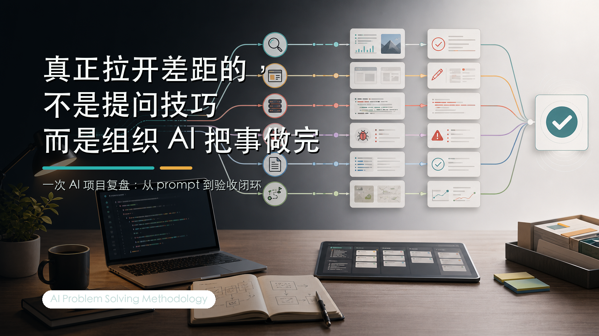

# 用 AI 做完一个项目后，我发现最难的是把事推进到验收



最近做完一个 AI 项目，我有个感受越来越强：

很多人用 AI，还是在“问它一个问题，等它给一个答案”。这当然有用，但在真实工作里，价值通常不在这一步。

更难的是：你能不能把一个模糊想法拆成能探索、能生成、能被反驳、能执行、能验收的任务，然后带着 AI 一步步往前推。

我最近在做一个叫 Script Killer 的项目。目标不复杂：把一批原始视频资料，处理成拉片证据、结构提炼、创作包，最后输出一套能拍的教学视频脚本。

说白了，就是：

> 我给它一堆视频，它帮我看完、提炼、总结，然后生成脚本。

这个项目后面我会把能公开的实现过程、踩过的坑，以及一些可复用的处理流程，整理到 GitHub 的 [script-killer](https://github.com/kevinyoung11/script-killer) 仓库里。它不是那种“照着跑就能复制一个商业产品”的仓库，更像一个真实 AI 项目从想法到跑通的记录。如果你关心 AI 怎么落到工程里，可以顺手看一眼。

这个方向听起来很适合 AI。真正做起来才发现，最难的不是让 AI 写几段代码，也不是让它写一篇脚本。难的是定义什么叫“完成”，以及怎么确认它真的完成了。

比如“上传视频”这件事。

看起来完成，是数据库里多了一条记录，里面写着 `storage_path`。

真的完成，是视频文件的 bytes 进了 Storage，有 checksum，后续 worker 能下载，能处理出关键帧、转录、shot、beat、technique，最后能基于这些证据生成创作包。

这两个状态中间差了很多层。AI 又很擅长把前者写得像后者：页面有了，测试绿了，文档也写了，然后告诉你“已经完成”。但你一跑端到端流程，就会发现：文件没真的上传，worker 没消费任务，测试用的是 fake client，真实环境里 `ffprobe` 找不到，数据库连接超时。

这些问题都不宏大，但任何一个都能让一个 idea 卡在半路。

我最后用 19 个 Claude Code 原始视频做输入，把上传、处理、证据生成、创作包、脚本输出完整跑了一遍。中间不是一次 prompt 解决的，而是很多轮调研、计划、执行、报错、修复、复盘、验收。

做完以后我才意识到：AI 时代厉害的不是“会问 AI”，而是会组织 AI 解决问题。


下面这 10 条，是我从这个项目里整理出来的经验。

## 1. 进入未知领域，先要地图，不要马上开干

很多人用 AI 做项目，第一句话是：

```text
帮我做一个 AI 视频脚本工具。
```

这句话太大了。大到 AI 只能开始脑补。

它会给你一个很完整、很漂亮、也很吓人的方案：素材系统、用户系统、任务队列、模型编排、前端工作台、知识库、权限系统、日志系统。每个模块看起来都合理，但你看完通常更迷茫。

进入一个不熟的领域，第一步不是让 AI 写方案或写代码，而是先让它帮你画地图。可以这样问：

```text
我想做一个从原始视频资料到教学视频脚本的工具。
我不熟悉这个领域。
先不要写代码。
请帮我调研这个问题的普遍方案：
1. 这个领域通常有哪些模块；
2. 最小可用版本应该包含什么；
3. 哪些能力看起来重要但可以后置；
4. 最大技术风险是什么；
5. 如果只做 first beta，建议怎么切。
```

这一步不是为了拿最终答案，而是先知道地形：哪里是平地，哪里是坑，哪里看起来很酷但现在碰了会拖慢项目。

很多项目做不下去，不是因为目标太难，而是一开始就选了地狱难度。

first beta 的意义，就是先做一个能跑、能验收、能被反馈的版本。不要一上来追求“全自动大片生成”。先做到资料能进来、结构能出来、脚本能被人看懂，这已经是进展。


## 2. 先做 first beta，再让另一个模型挑刺

单个模型很容易自洽。

它写了方案，解释方案，证明方案合理，最后告诉你：“综上，这是一个稳健的方案。”

这就像一个人写完作文后自己批改，还给自己打了 98 分。不是完全没用，但不够。

更好的方式是：先让 A 模型做 first beta，再让 B 模型站在反方 reviewer 的位置审查。比如：

```text
请你站在反方 reviewer 视角审查这个方案。
不要夸。
请找出它最可能失败的 5 个原因。
每个原因都要给证据、风险等级和修正建议。
请区分：必须现在修、下个版本修、未来再说。
```

这时候才会冒出一些真正有用的问题：

你的测试是不是只测了 fake client？上传是不是真的写进 Storage？worker 有没有真实触发？文档结论是不是过期？“完成”有没有可验证输出？

当然，不是 B 模型说什么都听。

有证据的批评，吸收；基于旧上下文的误判，丢掉；当前阶段不该做的建议，放进 future backlog。这个过程不是让模型互相投票，而是让方案经一次外部压力测试。

不要只让 AI 生成，也要让 AI 反驳。

## 3. 主线不清楚，AI 会把小工具写成大平台

AI 很勤快。但没有主线的勤快，常常会变成扩大范围。

我只是想修一个上传流程，它可能会顺手建议优化架构、抽象组件、加权限、重构数据层。每件事听起来都合理，但问题是：它们服务当前目标吗？

我当时的主线很明确：

> 原始视频资料进来，真实处理，生成教学视频脚本。

所以每个建议我都会问一句：这件事是不是让这条流程更真实？

如果是，推进。如果不是，后置。

一个很实用的 prompt 是：

```text
请把当前任务拆成：
1. 主线任务；
2. 必要支线；
3. 可后置支线。

如果某个建议不直接服务本次目标，请放入 future backlog，不要现在执行。
```

这句话能防止 AI 把“小工具”一路扩写成“企业级智能生产力平台”。

AI 可以帮你扩展能力，但别让它顺手扩展焦虑。

## 4. 多线程并行之前，先把上下文收好

AI 工作流里最大的变化之一，是个人工作可以从单线程变成多线程。

以前你在调研，就很难同时写代码；在修 bug，就很难整理文档；在做前端，也很难同时思考后台流程。

现在你可以同时开很多线程：方案讨论、前端执行、后台规划、bug 定位、文档整理、架构评估、未来规划。

但多开窗口不等于高吞吐。如果主线不清楚，多线程只是把混乱复制很多份。

比较稳的做法是，先在主线程收好一个上下文包。里面至少包括：

- 目标是什么；
- 当前状态是什么；
- 哪些已经验证；
- 哪些还只是猜测；
- 哪些不能动；
- 完成标准是什么。

然后再 fork。

比如开 bug 支线时，可以这样说：

```text
这是当前主线目标、最近改动、错误日志和已验证事实。
请只定位这个 bug。
不要重构无关模块。
输出根因、证据、最小修复建议和验证方式。
```

开未来架构支线时，可以这样说：

```text
这是当前 beta 已完成范围。
请从未来 3 个月演进角度评估架构风险。
不要建议现在重写。
请区分：必须现在改、下个版本改、未来再说。
```

高吞吐不是“开很多线程”。高吞吐是每个线程都有任务、有边界，最后还能回到主线验收。


## 5. AI 输出要先过滤，不要端上来就全吃

AI 输出里通常混着几类东西：

- 真的有价值的方案；
- 看起来专业但没有证据的判断；
- 当前阶段不该做的过度设计；
- 基于旧上下文的过期结论；
- 为了把话说圆而补出来的解释。

如果全部接收，项目后期会越来越难控制。它改了很多文件，但你不知道为什么；加了很多层，但你不知道哪层有用；说完成了，但你不知道怎么验收。

我现在会用五个问题过滤 AI 输出：

1. 它服务主线吗？
2. 它有证据吗？
3. 它是当前阶段必须做的吗？
4. 它会扩大风险吗？
5. 我能验收吗？

过不了这五关，先不要执行。

这不是不信任 AI，而是理解 LLM 的工作方式。它不是事实数据库，而是在上下文里生成最可能的答案。上下文错，它会错得很自信；目标模糊，它会补得很自然；验收缺失，它会把“写完”当“完成”。

## 6. 长任务要先规划，再让它连续执行

很多人用 AI 做长任务时，会遇到一个问题：AI 每做两步就停下来问你。

要不要继续？是否需要我执行？要不要我修复？

如果任务没规划清楚，它当然应该停下来确认。但计划已经确认、边界也明确时，就没必要每一步都问。

可以这样说：

```text
计划已经确认。
在不违反边界的前提下，请连续执行到验收完成。
中途不要因为常规下一步来问我。
只有遇到权限风险、数据风险、不可逆操作或计划外范围时再停下来。
完成后给我结果、验证证据和剩余风险。
```

这句话的前提是：计划要扎实，边界要清楚，验收要明确。

不然它就不是自动执行，而是自动失控。

## 7. Prompt 不是咒语，是把需求说清楚的能力

现在有一种说法：模型越来越强，不用学 prompt 了。

我觉得这话一半对。

确实不用背那种玄学模板，比如“你是一个拥有 20 年经验的世界级专家”。真正有用的不是这种话，而是需求表达。

LLM 吃的是自然语言。你描述问题的质量，直接影响它理解问题的质量。

比如你只说：

```text
帮我写篇 AI 文章。
```

它会给你一篇文章，可能能看，但很难贴近你的真实想法。

更好的输入应该包含：

- 目标是什么；
- 给谁看；
- 已有上下文是什么；
- 不要做什么；
- 什么叫完成。

你说得越清楚，AI 越像协作者。你说得越模糊，AI 越像一个很会排版的算命先生。

写 prompt 的过程也会倒逼你想清楚。很多时候你写到一半就会发现：原来自己也没想明白。

这不是坏事。这恰恰是 AI 协作有用的地方。

## 8. Vibe coding 的自由，来自想法能被马上推进

我以前也折腾过一些复杂方案，比如移动端联动、远程连接、自动化工具。后来发现，不一定非要有一套很酷的设备。

真正要紧的是：想法出现时，能不能马上推进一点。

很多想法不是在电脑前出现的。它们出现在走路、吃饭、睡前、刷视频、开会走神的时候。

如果这些想法只能躺在备忘录里，它们很容易变成灵感坟场。

一个更实用的小流程是：

> 手机捕捉想法 -> AI 整理成需求 -> 电脑端执行和验证 -> 结果回到文档、项目或文章。

不一定每次都完整执行。哪怕只是把一个念头整理成清晰 prompt，也比让它一直悬着强。

vibe coding 不是随便 vibe 一下，让 AI 变魔术。它更像是把想法不断压成可执行任务。

## 9. 双模型交叉，比单模型一路自洽更稳

我现在更倾向于让不同模型分工，而不是讨论“谁天下第一”。

在我的工作流里，Codex 更像主执行环境，适合调研、方案、读项目上下文、执行编码、跑测试、处理本地文件、推进主线。

Claude 更像外部 reviewer 和创意搭子，在前端、内容、文案、表达、页面设计、完成度 review 上经常更强。

这不是模型崇拜，而是工作流判断。

一个比较稳的模式是：

- Codex 做主线开发；
- Claude 做方案 review；
- Codex 修复问题；
- Claude 做 code review 和完成度 review；
- Codex 落地脚本；
- Claude 看表达和设计。

一个模型负责推进，一个模型负责挑刺；一个模型负责工程现场，一个模型负责体验和表达。

这比单模型一路自洽要稳很多。


## 10. Token 要够，其实是上下文要够

我说“token 要够”，不是鼓励浪费，而是说真实问题需要足够上下文。

很多人用 AI 太省了。他觉得多写背景很麻烦，于是输入一句：

```text
帮我优化一下。
```

AI 也只能泛泛优化一下。

看起来省了 500 字，后面可能多花 5 轮解释，甚至方向还错了。所以少输入不一定省 token，它可能只是把成本转移到返工上。

我现在更相信：

> 充分输入，减少返工。

你要把目标、背景、约束、受众、样例、失败经验、验收标准讲出来。这个过程会倒逼你自己想清楚。

很多 AI 协作失败，不是模型能力不够，而是人类输入太薄。上下文薄，模型只能猜；目标薄，模型只能补；验收薄，模型只能假装完成。

## 最后：AI 的价值不在一次答案，而在持续推进

很多 idea 死掉，不是因为它不好，而是因为它一直悬着。

你想了很多，收藏了很多，问了几次 AI，开了几个文档，但没有持续推进。过几天你开始怀疑：是不是我执行力不行？是不是这个东西没价值？

很多时候不是 idea 没价值，而是中间摩擦太多。

一个看似很小的东西，中间会迭代很多版本，会遇到很多意想不到的问题，会消耗时间、精力和 token。如果没有高吞吐和持续性，它很容易停在半路。

AI 真正改变的地方，是它让你更容易持续推进：

- 今天推进方案；
- 明天跑 beta；
- 后天让另一个模型 review；
- 再开 bug 支线；
- 再收回主线；
- 再跑验收；
- 再输出文章。

最后回头看，你会发现不是某一次 prompt 很神，而是你连续做了几十次小推进。

如果你想直接开始，可以复制下面这段 prompt：

```text
你是我的 AI 问题解决协作者。

请先不要急着执行。
我会给你一个问题或目标，你先帮我完成 6 件事：

1. 复述你对目标的理解；
2. 判断这是未知领域探索、方案设计、紧急问题、思路整理，还是执行任务；
3. 给出当前最小主线；
4. 区分主线任务、必要支线、可后置支线；
5. 输出 first beta 方案；
6. 说明如何验收，以及是否需要另一个模型做反方 review。

如果我确认计划，再进入执行。
执行时请保持主线，不要扩大范围。
如果任务边界已确认，请连续执行到验收完成；
只有遇到权限风险、数据风险、不可逆操作或计划外范围时再停下来问我。
```

这段 prompt 的重点不是格式，而是背后的工作方式：

先探索，再收拢；先做 beta，再找人挑刺；可以并行，但不能乱跑；可以信任 AI，但最后要验收。

工具会变，模型会变，入口也会变。

更值得练的是这件事：把未知领域变成地图，把模糊想法变成 beta，把自洽方案交给另一个模型驳斥，把多个线程收回主线，把 AI 输出过滤成可执行动作，把长程任务跑到验收。

这个时代最危险的，不是 AI 不够强，而是你一直站在旁边看。

你不需要立刻成为专家。但你至少要亲手跑一次完整流程。

因为只有跑过一次，你才会知道：问题不是“AI 能不能帮我”，而是“我会不会带着 AI，把一件事做完”。
